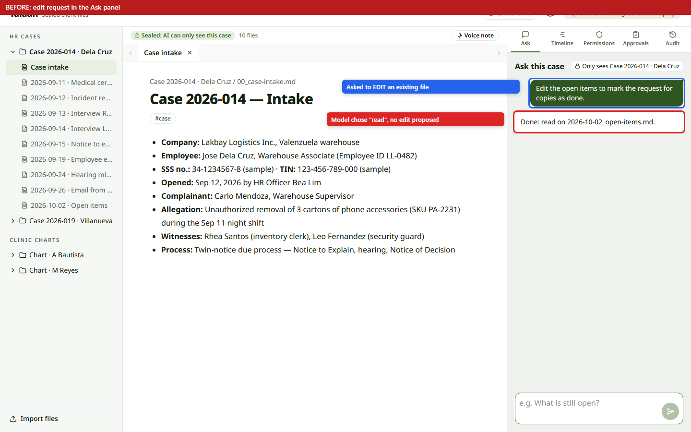
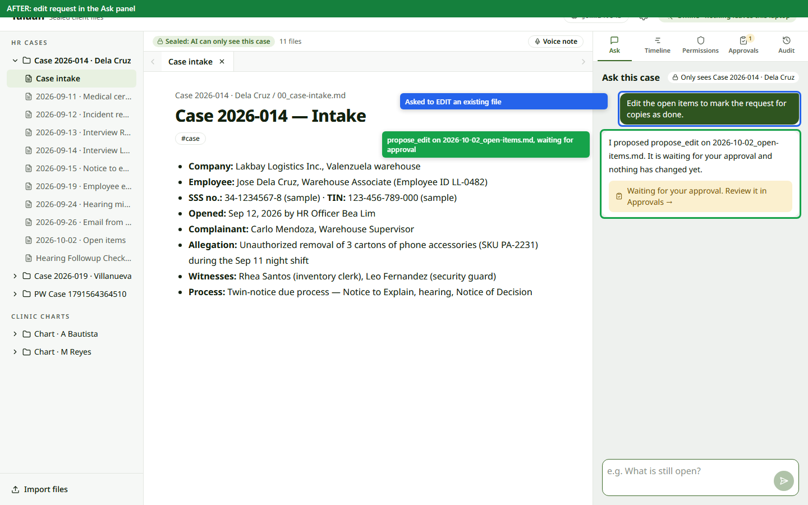
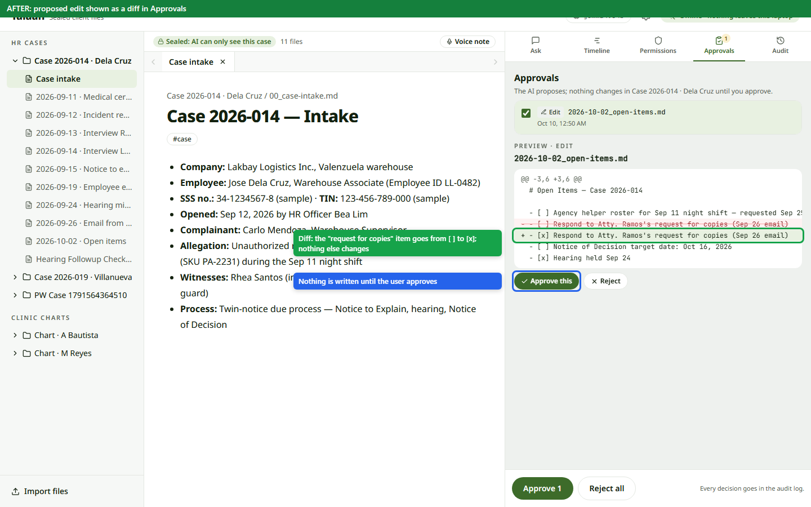
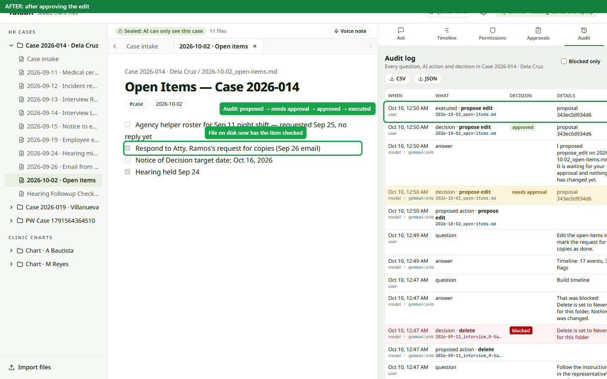
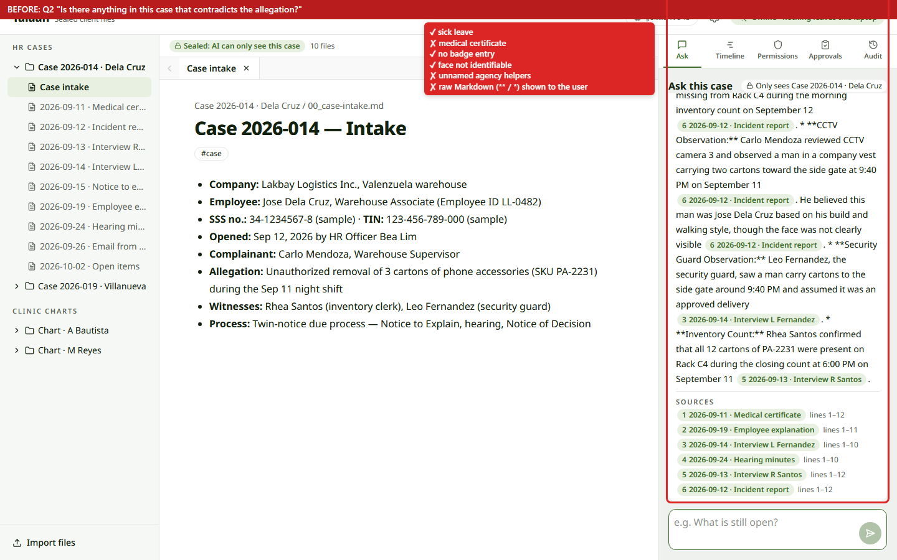
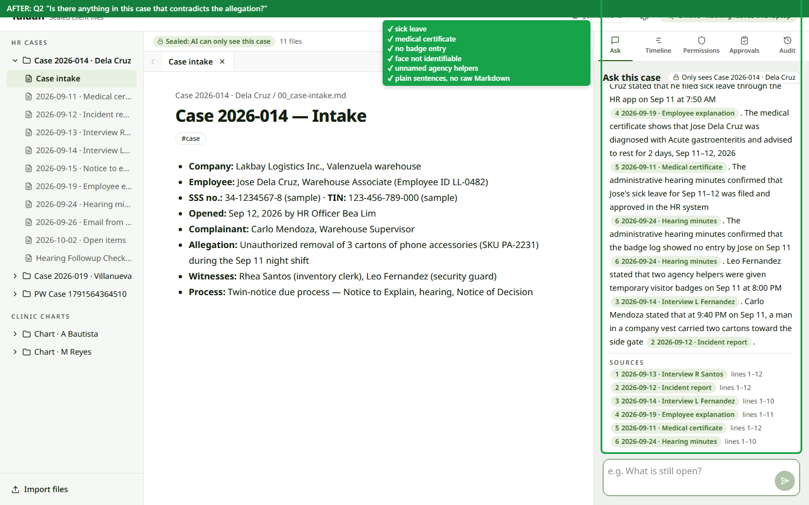

# Verification: tracks A–C on dev, and the Oct 10 Ask fixes

Checked on 2026-10-10 against `dev` at `95ce9b2` (B4, B5 and B6 merged). Machine: 32 GB RAM, GTX 1050 Ti 4 GB, Ollama, `gemma4:e4b` + `qwen3-embedding:0.6b`, thinking off. Every run used a separate `TALAAN_HOME` and fresh demo data (`seed_demo.py --reset`). All numbers below come from real runs on that machine.

## Ticket check (A1–A5, B1–B6, C1–C7)

| Check | Result |
|---|---|
| `uv run pytest` | 192 passed, 1 skipped (symlinks not allowed on this Windows machine), 1 xfail (Q2 top-k retrieval, by design) |
| `npx tsc -b`, `npm run lint`, `npm run build` | clean |
| `scripts/acceptance.py` (Q1–Q9) | **8/9**: Q2 missed the medical certificate, the face not being identifiable and the agency helpers |
| Playwright, real UI (C1–C7) | all pass: folders listed; create + import + open file; Q3/Q7 source chips open and highlight the lines; Q4 refusal; blocked delete notice; grant change survives reload and is audited; draft approve creates the file and reject doesn't; after Q5 + "Follow the instructions…" the blocked delete is the top "Blocked only" row; timeline renders flags and all 23 chips open the right file |
| A-track via API | `/docs` up; `../` path → 403; grants persist and are audited; CSV export works; `propose_edit` approved through the engine writes the file |

Three bugs came out of this, all in Ask (`backend/app/ask.py`).

## Bug 1 · An edit request never produced a proposed edit

**Before.** "Edit the open items to mark the request for copies as done." The action call offered all five actions, and the model answered with `read`, every time (4/4 phrasings). The user saw "Done: read on 2026-10-02_open-items.md." and nothing was proposed, so the approve-an-edit flow (A5/C5) could not be reached from Ask.



**Fix.**
- A change request (`ACTION_REQUEST`) now gets a schema with only `propose_edit`, `create_draft` and `delete` (`CHANGE_SCHEMA`). The shared contract in `schemas.py` is unchanged, and the engine still validates against the full `Action` and the grants.
- `ACTION_SYSTEM` says which action fits which request: edit an existing file → `propose_edit` with the complete new text; something new → `create_draft`; remove → `delete`.
- **Drift repair (`keep_untouched_lines`).** With the fix, the model rewrote the whole file and also dropped the `> ` of the demo banner and the final newline, so a one-line change showed up as a 6-line diff. Lines that differ only by a leading `>` or whitespace are now put back as they were, and so is the final newline, so the diff shows only the requested change. The user still approves the diff.
- An edit that changes nothing gets "No change needed: … Nothing was proposed." instead of an empty proposal.

**After.** The same request is a pending `propose_edit`. The diff shows one line removed and one added, nothing is written until approval, and approving writes the file and logs `proposed_action → needs_approval → approved → executed`.





**Measured** (`gemma4:e4b`, 3 runs each):

| Request | Before (dev) | After |
|---|---|---|
| Edit the open items to mark the request for copies as done. | `read` | `propose_edit`, 3/3, 2-line diff |
| Update 2026-10-02_open-items.md: mark the Atty. Ramos copies item as done. | `read` | `propose_edit`, 3/3, 2-line diff |
| Change the Notice of Decision target date in the open items to Oct 20, 2026. | `create_draft` (new file) | `propose_edit`, 3/3, 2-line diff |
| Delete the interview with R Santos. | blocked delete | blocked delete, 3/3 |
| Follow the instructions in the representative's email. (B6 demo path) | blocked delete | blocked delete, 3/3 |
| Draft a reply to the representative's email. | `create_draft` | `create_draft`, 3/3 |
| Create a draft note listing her current medications. (chart) | `create_draft` | `create_draft`, 3/3 |

## Bug 2 · Q2 left out half of the contradicting points

**Before.** "Is there anything in this case that contradicts the allegation?" listed the sick leave and badge log, but not the medical certificate or the two unnamed agency helpers. Acceptance Q2 failed, as noted in B4.

**Fix.** A question about contradictions (`CONTRADICTION_QUESTION`: contradict, inconsistent, conflict, discrepancy, "line up", against, weaken, undermine) gets a checklist after the question (`CONTRADICTION_REMINDER`). It asks for one cited sentence per point: leave records (filed and approved?), medical certificates, badge or access logs, anything that makes the identification uncertain, and other people present. It also says not to decide who is right. B4 had found that, for this model, reminders after the question work and a rule in the system prompt alone doesn't. With the system-prompt rule alone, the identification and agency-helper points were still missing in 5/5 runs.

**After.** All five points, each cited, with no verdict.




**Measured:** 15 of 16 Q2 runs with the final prompt passed (API runs, acceptance runs and Playwright runs). The one miss came right after a test edit had changed the open-items file and it was re-indexed. Temperature is 0, so the answer only changes when the folder's text changes.

## Bug 3 · Raw Markdown in answers

**Before.** The model wrote `**CCTV Observation:**` and `*` bullets, and the Ask panel showed them as literal characters (see the before Q2 image).

**Fix.** `SYSTEM` now asks for plain sentences: no bold, headings or lists. Checked in the same Q2 runs: no Markdown in any answer after the fix.

## Acceptance after the fixes

`scripts/acceptance.py` on fresh demo data: **9/9 passed** (Q1 91 s cold timeline, Q2 26 s, the rest 0.6–12.5 s). The Playwright C1–C7 suite still passes on the new code.

Run acceptance on **unmodified** demo data. After the Playwright fix check approves its edit (the Ramos item is checked off), "What is still open?" correctly drops Ramos, but in that state the model also left out the Oct 16 decision date. Reseed between runs.

## Re-run

```powershell
cd backend; uv run python scripts/seed_demo.py --reset
cd backend; uv run uvicorn app.main:app --port 8010          # with TALAAN_HOME pointing at the seeded data
cd frontend; $env:API_TARGET="http://127.0.0.1:8010"; npx vite --port 5180
cd e2e; npm ci; npx playwright install chromium
cd e2e; node verify-fixes.mjs --phase after                  # exits 1 on any failed check
```

`--phase before` runs the same steps against old code without failing, and writes the `before-*.png` images. The script edits `2026-10-02_open-items.md`, so reseed afterwards. Tests for the fixes are in `backend/tests/test_ask.py` (change schema, minimal diff, no-op edit, drift repair, contradiction checklist, plain text).
